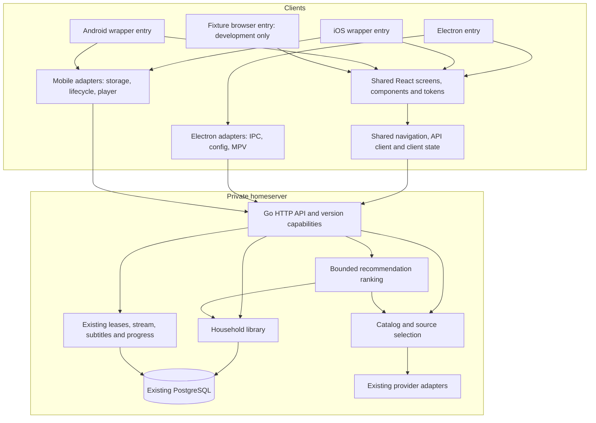
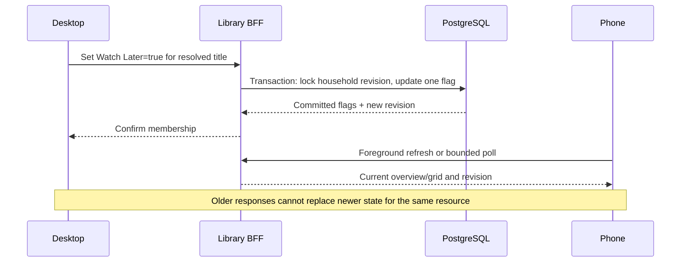

# torWatch shared mobile alpha architecture

Status: architecture for implementation, 2026-09-06. The owner accepts the revised wireframes **for alpha only**, and considers their visual quality below the desired final standard. Build their interaction model now; preserve a later visual refinement phase. Do not report the alpha design as final or production-polished. No mobile runtime, playback, or performance result has been verified by this documentation work.

## Authority and scope

Read [spec](../../specs/002-mobile-shared-ui/spec.md) for outcomes, this document for architecture, [plan](../../specs/002-mobile-shared-ui/plan.md) for API proposals/ranking/performance/phase gates, [data model](../../specs/002-mobile-shared-ui/data-model.md) for persistence, [change map](change-map.md) for file ownership, and [tasks](../../specs/002-mobile-shared-ui/tasks.md) for execution. The [design extension](design-system.md) and five [wireframe boards](wireframes.md) define the alpha presentation. The constitution and feature 001 contracts govern shared backend behavior; amendments must be additive or explicitly versioned and tested.

Goal: reuse the existing React renderer for Electron, iPhone, then Android. One shared Go BFF owns the viewing journey and household library. Thin mobile wrappers supply device integration; a separate SwiftUI/Compose/React Native UI rewrite is outside this feature. Capacitor is the candidate wrapper, conditional on M1's actual playback/toolchain experiment. Browser preview is a development checkpoint, not completion of phone playback.

## Runtime topology



One UI source means a component fix is compiled into each target. It does not mean editing Electron instantly updates installed phones. One backend means membership changes sync without new app releases. Platform-specific player controls can differ while source choice, progress, library and recommendation semantics remain shared.

## Source layout: incremental, not a prerequisite rewrite

Keep the first working shared slice inside `electron-app/src/`. Introduce platform interfaces and a browser-safe entry there, then have `mobile-app/` consume that same source. Separate build outputs so a mobile build cannot empty Electron's `dist` directory. Keep Electron's player-controls/setup/startup entries and installer resource list intact.

Suggested additions (paths are targets, not existing files):

```text
electron-app/src/
  platform/
    contracts.ts              # interface-only runtime boundary
    electron.ts               # only this adapter reaches Electron IPC
    mobile.ts                 # wrapper integration; native implementation after M1
    fixtures.ts               # explicit test-only adapter
  shared/
    AppShell.tsx              # injected services, common destinations
    navigation.ts             # route and restoration state
  lib/services/
    library-service.ts        # typed BFF access only
    recommendation-service.ts
  components/
    ContinueCarousel.tsx
    LibraryToggle.tsx
    LibraryShelves.tsx
    SelectionSurface.tsx
    TorrentSourceRow.tsx
  pages/
    LibraryPage.tsx
    LibraryCategoryPage.tsx
mobile-app/
  package.json                # shared source dependency/build entry; no screen copies
  capacitor.config.ts         # only after wrapper decision
  src/main.tsx                # construct mobile adapters and mount shared app
  ios/                        # native project; generated after M1 decision
  android/                    # after iPhone slice
torrent-streamer/internal/
  library/                    # service, repository boundary, SQL persistence
  recommendations/            # deterministic ranking over existing catalog
  httpapi/library_handlers.go
  httpapi/recommendation_handlers.go
specs/002-mobile-shared-ui/
  contracts/                  # create/finalize in M3.1 before backend consumers
  evidence/                   # compact reports, not secrets or real history
```

If source consumption across entries proves awkward, extract `packages/ui`, `packages/client-core` and `packages/platform` in a separate behavior-preserving task after the first passing slice. Do not spend the alpha on an unrelated monorepo migration. Use one React instance and one token source in all shared bundles; keep Node/native modules out of the mobile import graph.

## Ownership and dependency rules

| Boundary | Owns | Must not own |
|---|---|---|
| Shared UI | Responsive layout, icons, accessible controls, pending feedback, animations | IPC calls, provider keys, torrent ranking, SQL, client-specific copies of screens |
| Shared client core | Routes, query cancellation, typed HTTP, capability gates, revision-aware cache | Canonical title merging, durable household truth, native player internals |
| Electron adapter | Existing config bridge, window controls, MPV, desktop lifecycle | Mobile-only conditions spread across shared pages |
| Mobile adapter | Saved server origin, device ID, OS lifecycle/back/insets, chosen player | Torrent engine, embedded Go service, direct catalog-provider fallback |
| Go BFF | Catalog/source rules, progress, library, recommendations, errors/capabilities | UI breakpoints, navigation hierarchy or animation state |
| Persistence | Transactional memberships and revisions, existing progress | Local device storage as authority for household state |

Runtime choice happens at composition roots. Viewport size determines layout, not whether Electron APIs are available. Shared services must not read a mutable origin once at module import and then ignore Settings changes. On server switch, cancel in-flight requests, end the old playback lease, clear capability and household caches, and reconnect under the new origin. Never send a queued old-server write to the new server.

## Adapter contract responsibilities

Finalize typed signatures against current consumers in M1.1; these names are logical contracts, not implemented APIs.

| Port | Required behavior |
|---|---|
| Connection/config | Load/save validated server origin; checking/ready/unreachable/incompatible states; version fetch without Electron prerequisites; config-change subscription |
| Device storage | Stable client ID and device preferences; storage failure surfaced; no provider credentials; household cache keyed by server origin |
| Player | Start from BFF-resolved context; stop/seek/pause; position/state/subtitle events; explicit supported/unknown/unsupported capability result; deterministic unsubscribe/cleanup |
| Navigation/lifecycle | System Back, focus/visibility, keyboard and foreground transitions; restore stack/scroll/filter; OS owns permission dialogs |
| Desktop chrome | Optional window actions and MPV host binding, injected only for Electron |
| Test fixture provider | Same interface shapes and component tree as real clients; production cannot silently choose it |

Do not globally stub `window.electronAPI` in a WebView or disable setup checks to get a screenshot. Replace each direct dependency with an actual adapter. Audit `App.tsx`, `config.ts`, setup/player bridges, `WatchPage`, `PlayerPage`, `TorrentPanel`, and callers beyond this initial map.

## Key runtime sequences

**Startup:** load connection preference → call existing `/v1/version` and readiness → check protocol/capability support → create BFF services for that origin → mount shared routes. Missing library capability only affects library/suggestions; it does not break the existing catalog journey. Missing/failed discovery is not positive evidence that a new feature is supported. Existing version-check code primarily checks protocol ranges; add feature-level checks explicitly. Mobile is BFF-only even while legacy renderer/provider mode remains available for desktop rollback.

**Continue Watching:** artwork/play tap → resolve saved title/episode/source using existing BFF rules → acquire/retain the existing stream/session lease → adapter starts playback → report progress using existing sequence/ordering semantics → stop/release on completion/exit. Title tap opens detail. Swipe release never starts playback. Do not create a second incompatible progress writer or assume background callbacks always execute.

**Torrent selection:** context is an exact movie or episode → fetch existing source candidates → preserve previously used/source identity → select row without playback → inspect optional details → Play triggers resolution and capability validation → adapter opens supported stream or returns actionable failure. Unknown compatibility is probed through the selected path; unsupported media is not declared playable by parsing a filename. A vanished source clears selection rather than switching silently. Cancelled/late responses from another episode cannot replace the active list.



**Library:** independent booleans, one household scope; field-level updates; no offline write queue in alpha. Group by canonical media kind on the server and fetch previews plus full counts, then paginate scoped grids. Compare revisions per cached resource/title, not just one global UI number: a response for resource A must not cause a useful equal/older snapshot for resource B to be discarded without refreshing B. Revision tokens must describe a consistent database snapshot. Cache keys include server origin, collection, kind, sort and cursor. Refresh on reconnect/focus and at most every 15 seconds while visible. Healthy cross-client visibility target is ≤20 seconds.

**Recommendations:** existing cached discovery candidates + up to 20 favourites → bounded deterministic genre-overlap ranking → exclusions and canonical deduplication → at most 20 cards with truthful reasons. Use plan.md's exact weights/tie-breaks/fallback/cache policy. No new ML service or direct provider calls per rendered card.

## BFF contracts, identity and database gates

The new library/overview/write/recommendation endpoints in plan.md are proposals to formalize in M3.1. Advertise proposed `library.household.v1` / `recommendations.basic.v1` strings only after matching handlers and migrations are ready; finalize these names in the contract. Preserve the existing `GET /v1/version` payload and protocol negotiation rules. A mobile-player capability name is deferred until M1 establishes what it actually guarantees.

**Identity gate: RESOLVED (M3.1, 2026-09-06).** The investigation in [evidence](../../specs/002-mobile-shared-ui/evidence/m3.1-identity-contracts.md) proved with deterministic fixtures that the opaque `tmdb:<numeric>` id is ambiguous: TMDb movie and tv numeric namespaces are independent upstream, both can hold the same number, and the detail probe resolves movie-first — a series with a colliding numeric id is unreachable through the unqualified form. Resolution (bounded compatibility child task **M3.1.1**, required before library persistence): emit **media-qualified canonical ids `tmdb:movie:N` / `tmdb:tv:N`** from the catalog, keep unqualified `tmdb:N` as a read alias using the existing movie→tv probe, and make detail/episode consumers request by the card's opaque `catalogId` instead of rebuilding `tmdb:<numeric>`. Watch progress already uses the qualified vocabulary (`tmdb:tv:N`/`tmdb:movie:N`) — no rekeying, no silent mapping. Anime is a classification over the structural id, so anime never duplicates under Series. The finalized library contract is [contracts/library-api.md](../../specs/002-mobile-shared-ui/contracts/library-api.md).

Use the existing database and migration runner. Choose the next unused migration number at implementation time; 005/006 already exist in this checkout. Expand schema first, then ship endpoints, migrate one consumer, migrate other consumers, and retain additive data on binary rollback. [data-model.md](../../specs/002-mobile-shared-ui/data-model.md) defines write ordering and lifetime rules.

## Mobile media and connection decision gate

An Electron MPV stream is not automatically playable inside a phone WebView. M1 must record container/video/audio/subtitle/transport, seek and range behavior, supported OS/device, interruption and resume. Prefer the existing direct stream where proven; if a native player plugin, remux/HLS, or transcoding is required, append explicit tasks with CPU/memory/ARM64 cost, cancellation cleanup and old-client compatibility. Do not promise hardware acceleration on Radxa without measurement. Keep that work isolated from the UI extraction.

Use the existing private-network deployment boundary. Phone origin must resolve to the server, not its own localhost. Test CSP, CORS, OS transport trust and local-network permissions against actual dev and packaged origins. Do not use global trust bypasses. Phone clients do not configure provider secrets. No public listener, app-store submission or remote-update service is introduced here.

## Delivery and completion

M0 → M1.1/M1.2 → M2 → M3 → M4 can progress without Radxa or an available Mac once the affected local baseline is established. Run M1 device playback when hardware is available. M5 needs that evidence; M6 adds Android and the real homeserver gate. The owner has authorized the alpha design direction; do not repeatedly request visual approval for routine implementation choices. Material product/architecture changes still need a documented decision.

Each task leaves a runnable slice, adds relevant verification, and records rollback. Measure plan.md's latency/frame targets rather than claiming “smooth” from screenshots. Follow [visual-qa.md](visual-qa.md) with real application captures and a bounded fix/recapture pass. Report blocked hardware separately from passing fixture/UI work. Native support stays unclaimed until the corresponding native gates pass.

Alpha completion is US1–US5 plus applicable gates, not completion of a mock UI alone. Later visual refinement remains explicitly open; it may improve composition, motion and surface finish while retaining the shared architecture and verified behavior.
