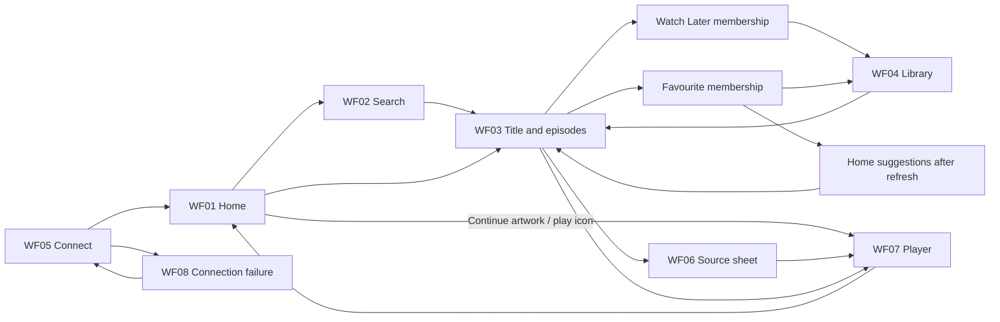

# Wireframe guide

Status: accepted for alpha on 2026-09-06; the owner considers the visual quality short of the desired final standard. These are interaction/layout references, not screenshots of a working app or final polish approval. Fictional titles and placeholder artwork are deliberate fixtures. The boards use default-size 390×844 phone frames; inset measurements are illustrative. Implementation must read actual runtime insets and reflow with text size/content.

Open [browse board](wireframes/browse.svg), [library and connection board](wireframes/library.svg), [torrent list and playback](wireframes/platforms.svg), [Android and library states](wireframes/android-states.svg), and [category grids, torrent details and search filters](wireframes/organization.svg). SVG text is selectable and zoomable. The adjacent PNGs are rendered copies for multimodal agents. WF03a and WF04a expand the parent screen contracts with save failure and empty states. These revised boards replace the earlier pill-heavy drafts.

## Journey

## Screen contracts

| ID | Reading order and action | Required variants |
|---|---|---|
| WF01 Home | Bare Settings; Continue carousel with play overlay/progress; open media-category rail; suggestions with reason; icon-and-label bottom nav | Artwork resumes, title opens detail; drag never plays. New household hides Continue Watching and uses Popular picks; skeleton, empty and partial-provider failure |
| WF02 Search | Back icon; input with search/clear icons; filter icon; tappable results | Keyboard visible, empty query/results, loading, cancelled/late query, provider error; Back restores query |
| WF03 Title | Bare Back; backdrop/name/metadata; compact rectangular Play + bookmark/heart/sliders; synopsis; episode rows with play icons; labelled Torrents row | Film without episode list; show/anime; unavailable episode; selected/pending/failed icons with text feedback; unsupported playback reason |
| WF04 Library | Underlined Watch Later/Favourites tabs; sort icon; Movies/Series/Anime shelves with total counts and heading chevrons | Correct scope/counts beyond first page; empty shelf/collection, two-line titles, retry, stale data, removal with feedback |
| WF05 Connect | Server address; connect action; short private-network guidance | Checking, validation, saved server, incompatible version, permission denied; no provider credential requested on phone |
| WF06 Torrent sheet | Bare Close; title/episode context; count/sort/refresh; release/quality/size/seeders/codec/language rows; selected state; fixed Play footer | Loading, no sources, failure/Retry, unsupported/unknown compatibility; full details behind a separate disclosure; selecting never immediately plays |
| WF07 Player | Fullscreen video; close/back; play/pause; seek/time; audio/subtitles; overflow if needed | Loading/buffering, seeking, subtitles, retry/choose source, ended, background interruption, landscape; native controls may differ |
| WF08 Connection failure | Keep saved context; explain unreachable server; Retry and Edit server | No spinning forever; cached data explicitly stale; no fake successful save; do not erase library |
| WF09 Expanded desktop | Electron chrome and desktop navigation; familiar two-column detail | Same actions/data as WF03, keyboard focus, resized window; MPV native player retained |
| WF10 Android compact | Same content hierarchy and shared controls | Android Back, system/keyboard insets, Material/system pickers and permission UI; no painted iOS home indicator |
| WF04b Scoped grid | Back; media-kind heading; current collection/count; sort; full poster grid | All pages server-filtered to the same collection/type; Back restores originating shelf |
| WF06a Torrent details | Back; full release name; technical/source/probe details; Use this torrent | Unknown data explicit; returns selected source to list; does not start playback; unsupported source cannot be confirmed |
| WF02a Search filters | Back; icon-and-label single-select list for All/Movies/Series/Anime; Apply | Cancel preserves prior filter; Apply preserves query and resets result pagination |

The source sheet and player board shows a full phone sheet plus a landscape playback frame. These are wire diagrams, not pixel-perfect native system controls. Platform-owned controls must be verified against the real OS. The phone content scrolls; bottom navigation is hidden during fullscreen playback and keyboard-focused Search as needed to preserve usable results.

## Component mapping

WF01 adds ContinueCarousel around shared ContinueCard behavior; WF01/02/04 reuse PosterCard/MediaRow; WF04/04b share collection/type/sort state. WF03/09 reuse TitleSummary, TitleActions, LibraryToggle and EpisodeList. WF06/06a reuse the existing TorrentPanel metadata and source-selection contract through adapted rows and a SelectionSurface. WF07 reuses playback intents with an adapter; WF05/08 reuse ConnectionState. A visual change to one shared component must be reviewed on its phone and desktop hosts together.
