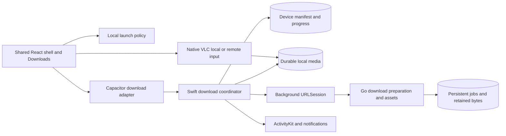

# Architecture and change map

## Baseline evidence

At documentation time, `useConnectionGate` in `src/platform/PlatformProvider.tsx` stores `everReady` only in a ref. `src/browser/main.tsx` returns a full-screen LaunchScreen when `showGate` is true; native mobile composes that entry. Thus a fresh offline launch blocks the shared shell even for a previously configured server. `AppShell.tsx` already has Settings but no Downloads destination. `mobile/origin-config.ts` rejects failed replacement addresses but its probe does not perform the same complete protocol reasoning required by this new feature. `TorWatchNativePlugin.swift` uses MobileVLCKit; the current player route/controller performs remote session setup. No production local download inventory is exposed by `platform/contracts.ts`.

Read current files before implementation: the parallel homeserver task may change backend configuration/contracts. Preserve `App.tsx`'s Electron setup behavior for this iPhone release. Changes to shared helpers need desktop regression coverage.

## Ownership

React owns presentation/navigation; native iOS owns durable bytes, jobs, lifecycle, and local progress. Go owns torrent selection/validation, asset preparation, admission and retention. A Live Activity mirrors state and is never the source of truth. Keep the existing stream/watch APIs unchanged and add versioned capabilities only after their implementations and tests exist.

## Connection model and migration

Replace the binary gate with a pure, tested initial-route policy using configuration presence, local inventory/read failure, saved tab, and explicit deep-link intent. Reachability is a separate observable used for contextual availability only. A saved configuration opens Home/last valid tab; users select Downloads directly. Do not implement the superseded three-second redirect deadline or interaction latch.

Existing setup probes can take longer for a fresh private-overlay TLS connection. Centralize connection discovery with deduplication, cancellation, generation guards, bounded probe timeout and bounded retry; avoid multiple `connection.check()` calls driven by each status chip/hook. Retry on explicit request, suitable network changes and foreground entry. Checks never remount the returning user's shell or navigate. Pending checks do not delay local Downloads.

Migrate a valid saved `mw_server_origin` as configured. Persist `serverDraft` separately for failed onboarding attempts. A configuration read error is a recovery state, not first installation. A new successful save updates the current scope only after durable persistence. Preserve existing stop/cleanup behavior for remote sessions; local playback survives a server URL change. Inventory and offline progress keep their original server scope.

## Change map

Paths below are relative to the repository root. New filenames are targets and may be adjusted to project conventions with an updated map.

| Current file/boundary | Change | Verification / removal gate |
|---|---|---|
| `electron-app/src/platform/PlatformProvider.tsx` | Replace mobile `everReady` gating with shared connection observation and pure launch policy | C1–C8; keep compatibility export while consumers migrate |
| `electron-app/src/browser/main.tsx` | Mount shell for configured users, add capability-gated downloads routes, respect interaction/deep-link intent | Startup, Back, query and settings tests; fixture captures |
| `electron-app/src/mobile/main.tsx` | Construct native downloads adapter, load local inventory without network, preserve single root and settings lifecycle | Cold launch, background return, error recovery |
| `electron-app/src/platform/browser.ts`, `src/mobile/origin-config.ts` | Shared normalized probe/save contract; distinguish saved config from fallback origins, draft from active URL | Existing failed-save tests plus protocol and migration cases |
| `electron-app/src/mobile/ServerSettings.tsx`, `components/shared/LaunchScreen.tsx` | WF01/WF03, preserve inputs on retry, local-access escape when files exist | Permission, error, Back and persistence cases |
| `electron-app/src/components/shared/AppShell.tsx`, `ConnectionChip.tsx` | Capability-gated fourth tab, gear, quiet healthy status, contextual offline notices | All app entries and viewport widths |
| New `src/lib/launch-policy.ts`, `src/pages/DownloadsPage.tsx`, `src/components/downloads/` | Policy, queue/list/detail/sheet/conflict UI | Deterministic tests plus explicit fixture preview |
| `electron-app/src/platform/contracts.ts` and new native downloads adapter | Optional downloads capability; snapshot/subscription and command contracts; no platform checks scattered across pages | Browser/Electron absence and iOS presence tests |
| `src/platform/native-player.ts`, `native-playback-controller.ts`, `pages/PlayerPage.tsx` | Explicit local-download input beside current remote request; local progress route | Zero network local start; existing remote tests remain green |
| `electron-app/ios/App/App/TorWatchNativePlugin.swift`, `AppDelegate.swift` and proposed `Downloads/` | Native coordinator, background session delegate recovery, manifest, file validation, local VLC entry | Xcode tests and physical iPhone |
| iOS project/Info.plist and new WidgetKit extension | ActivityKit availability and lifecycle; notification/deep-link handling; preserve existing signing setup | Signed device, denied permissions, stale activity |
| Proposed `torrent-streamer/internal/downloads/`, HTTP handlers, additive migrations | Persistent prep jobs, immutable manifests, resumable media and explicit retention/admission | Contracts, restart/cleanup, range and expiry tests |
| `torrent-streamer/internal/torrentx/`, janitor/admission boundaries | Download retention pins and bounded prep capacity; downloading must not starve streaming or be evicted mid-transfer | Concurrent viewing + downloads, storage pressure |
| Existing progress repository/HTTP boundary | Add revision-conditional offline import with idempotency | Concurrent writes, retries, rewind/completion conflicts |

## Native data and commands

Use a native transactional store (SQLite through the iOS system library is the preferred baseline) and files under app Application Support, excluded from cloud backup. Select file protection to allow already-authorized background finalization after first unlock; do not weaken protection for unrelated settings. Validate on a real locked phone. Use staging directories and same-volume atomic finalization. Persist migration version, transactionally update records, reconcile OS tasks and manifests after termination, and never recursively delete outside the resolved download root.

Each local record carries `downloadId`, server scope, canonical title/episode/file identity, source/asset revision, native background task ID, state/reason, expected/received bytes, strong validator/hash, relative local paths, requested tracks, minimal display metadata, saved progress, and conditional-sync base revision. Keep stable relative paths, not sandbox absolute paths that can change between launches. Native code resolves a download ID to an owned file; JavaScript cannot ask the player to open arbitrary filesystem paths.

Adapter operations: list/get snapshot, subscribe with monotonic snapshot revision, enqueue, pause, resume, retry, cancel, remove, open local playback, and report storage. Persist commands before acknowledging them. A newly mounted UI reads a snapshot so missed background events cannot strand it. Pause stops transfer; cancel removes staging bytes and releases the corresponding job claim; remove ready content confirms deletion. Stop active local playback before deleting its files. Server cleanup failures become bounded pending work scoped to the original server.

## Backend contract gate (D01)

Introduce a proposed `downloads.offline.v1` capability and `/v1/downloads` surface. Finalize exact request/response schemas and tests before implementation. Required semantics:

- Create a preparation job with an idempotency key and validated opaque source/file identity. Reuse current source resolution; never fetch arbitrary user URLs or expose provider secrets/magnets through download manifests.
- Get a durable job state: preparing, ready, failed, cancelled, expired; return safe reason codes. Server restart resumes/reconciles preparation.
- Ready returns a versioned manifest of a complete immutable video and sidecars with lengths, hashes/strong validators, expiration, and origin-relative asset URLs. Validate URL ownership and forbid cross-origin credential forwarding.
- Assets support HEAD, stable ETag, Range/If-Range, correct 200/206/416, and bounded efficient streaming. A changed validator invalidates resume data and triggers explicit restart, never append bytes from a different revision.
- Retention is independent of watch heartbeats. Default job retention proposal: 48 hours from ready, extendable through an explicit renewal; pin active response readers until completion, then bounded cleanup. Expiration while a device is paused yields Needs preparation when it reconnects. Completed device files remain playable.
- Bound preparation concurrency/storage; keep existing viewing capacity protected. Account for unclaimed jobs, crashes, cancel, retries, disk full and storage cleanup.
- Download URLs/IDs do not establish application authentication. Keep the current private LAN/overlay boundary and avoid introducing public exposure. Record redacted job IDs in diagnostics, never URL tokens or complete source magnets.
- Persistent server-instance identity is required for safe progress scope. Add it to version discovery if absent after the homeserver work. A URL change may refer to the same instance; equal URLs after a reinstall may refer to a different instance. Never infer sameness from hostname alone. Older servers can connect/browse without advertising offline-download capability.

For offline progress, finalize a separate capability and additive endpoint accepting canonical progress identity, expected base revision and stable update ID. Apply in a transaction only when the revision matches (or record is absent with the appropriate base). Return committed revision, or conflict containing current server position/revision. Idempotent retries return the recorded result. On local continued playback while sync is in flight, acknowledge only the uploaded local revision and keep the newer local revision pending. User conflict resolution creates a fresh conditional update. Never send queued data to a different server instance.

## iOS feasibility and supported limitations

Before promising native operation, prove background URLSession transfer and file finalization, local VLC/subtitles, restart recovery, and ActivityKit on a signed physical iPhone. Follow Apple's current documentation linked in `experience-brief.md`, rechecking API availability with the actual Xcode SDK. Force-quit is not the same as OS termination; reopening must recover, but uninterrupted transfer after user force-quit is not promised.

Server prep finishing while the app is suspended uses the explicit reopen-to-start-transfer behavior in D6. A later unattended handoff needs a separate tested design. Do not hold a background HTTP request open indefinitely, simulate progress with timers, or add silent push infrastructure to conceal the limitation. During locked transfers, update Live Activities when the OS permits; use stale dates and explicit final state. Completion notifications occur only after local verification.

## Migration, release and rollback

Ship C independently with a downloads adapter reporting unavailable until native D exists; fixture data is test-only. Keep D/N behind capability and release controls until verified. Do not connect empty scaffolding to production. Additive DB migrations preserve old binaries; implement download job/schema guards and test downgrade behavior before claiming rollback.

Rollback a client feature flag/build without deleting local media or its manifest. Document schema forward/backward compatibility; do not downgrade a client into destructive cleanup of an unknown manifest. Backend rollback must preserve existing playback and state, drain active asset responses or report interruption, and prevent orphan prep work; retained files can expire by the documented lifecycle. No deployment/Compose changes unless the finalized retention/storage requirements need them after the homeserver checkpoint.
