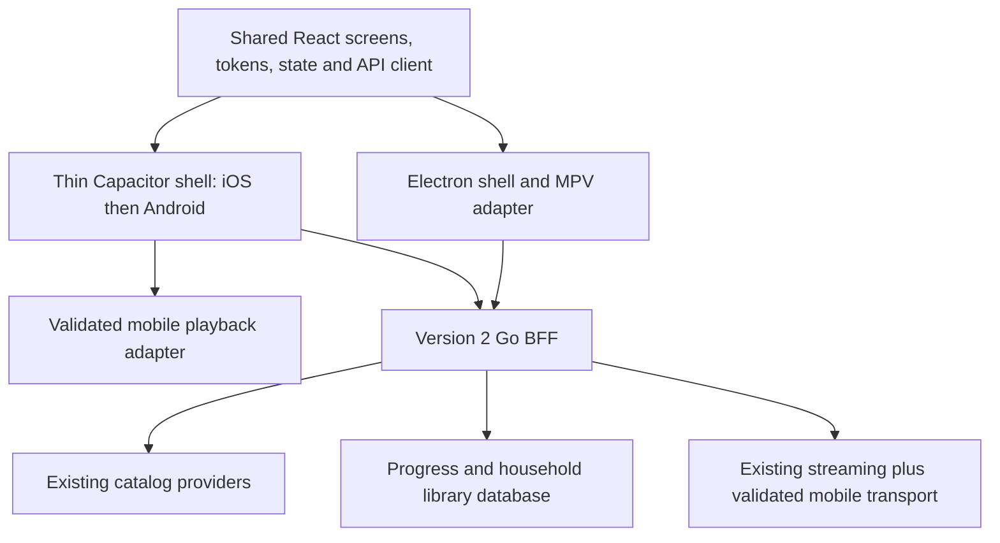

# Shared mobile implementation plan

Status: implementation IN PROGRESS as of 2026-09-12. M0.1, M1.1, M1.2, M1.3.1–M1.3.8 (server foundation only), M2.1–M2.5, M3.1–M3.4, and M4.1–M4.2 are complete with evidence under `evidence/`. M0.2 is PARTIAL: automated Electron/staging behavior is proven, while the real source→stream→subtitle→server-resume operator flow remains open. M1.3 and M1.4 parent device gates, native Capacitor clients, M5/M6, and Radxa validation remain open and unclaimed. Implement remaining work using [tasks.md](tasks.md), [architecture.md](../../docs/mobile-ui/architecture.md), [change-map.md](../../docs/mobile-ui/change-map.md), and [data-model.md](data-model.md). The shared React UI remains the single presentation implementation; platform playback stays behind adapters. Alpha wireframes are accepted with later visual refinement still open.

## Playback compatibility service (M1.3.x, 2026-09-12)

The shared mobile playback foundation is server-side only for now: `torrent-streamer/internal/playback` + `/v2/playback/*` (contract: `contracts/playback-api.md`). Capability `playback.compat.v1` is advertised only with a verified FFmpeg/ffprobe toolchain. Decision table: direct (compatible MP4/fMP4 + codecs within profile bounds), remux (FFmpeg stream-copy to HLS/fMP4, e.g. MKV), transcode (bounded H.264/AAC for incompatible codecs or profile resolution/bitrate; one active process by default), or unsupported (actionable reason codes). HDR rejected by a client profile is unsupported until the service has a verified tone-map pipeline. Magnets never reach tool command lines: a loopback-only token-authenticated internal media source feeds ffprobe/ffmpeg. Subtitles: SRT/VTT sidecars and container text streams → WebVTT with a validity gate; ASS/SSA convert with styling loss; PGS unsupported; external OpenSubtitles keeps using the existing `/v1/subtitles` endpoints. Native iOS (AVPlayer) and Android (Media3) adapters plus the Capacitor shell are the NEXT milestone and remain unbuilt.

## Architecture and what changes together

The BFF owns catalog merging, source selection, progress, library persistence, and recommendation ranking. A client owns responsive presentation, temporary pending UI, navigation, and runtime capabilities. Tokens/components propagate through shared source and coordinated rebuilds; data propagates through the BFF. Installed clients need their own releases. Do not promise automatic UI hot updates.

Start with a browser-safe entry in the current React project, consuming the same components as Electron. Extract packages only after a passing vertical slice proves the boundary; a monorepo reorganization is not a prerequisite. Proposed eventual boundaries: `packages/ui`, `packages/client-core`, `packages/platform`, existing `electron-app`, and `mobile-app`. Names are provisional; no separate mobile copies of HomePage, TitlePage, LibraryToggle, or recommendation logic.

## Migration map

| Current source | Proposed responsibility | Characterization before moving |
|---|---|---|
| `electron-app/src/App.tsx` | Shared route/state logic plus injected connection service | First run, ready, failure, unknown route, Back |
| `components/WindowChrome.tsx`, AppHeader | Electron chrome adapter; shared destination model | Titlebar, shortcuts, restore focus, narrow desktop |
| `lib/api-client.ts`, catalog-bff, catalog-gateway | Shared BFF transport and DTO mapping; injected server origin | Existing catalog and error contracts; no provider fallback in BFF mode |
| `pages/WatchPage.tsx`, PlayerPage | Shared playback intent + injected playback service | Existing start/stop, source choice, session lease, progress ordering |
| `setup/bridge.ts`, config store, device-id | Platform config/device storage adapter | Origin selection, stable client ID, permission failure; phone never assumes localhost is Radxa |
| `globals.css`, ui components, PosterCard | Shared semantic tokens and accessible controls | Desktop screenshots, pointer/keyboard behavior |
| `torrent-streamer/internal/catalog`, httpapi | Existing catalog plus new library/recommendation contracts | Existing movie/series/anime IDs, provider errors, compatibility |
| `torrent-streamer/migrations`, new library package | Additive household membership storage | Upgrade from prior fixture database, retries, restart, rollback compatibility |

Imports in the shared graph must not require `electron`, Node modules, IPC globals, or provider secrets. Platform service signatures are explicit: connection/config, capability discovery, navigation/back lifecycle, player start/stop/events, and device storage. The browser fixture adapter is test-only and cannot silently activate in a production build. Inventory other direct `window.electronAPI` references before extraction; this table is a starting map, not a claim that every coupling was enumerated.

## Proposed additive API contract (finalize in M3.1)

These endpoints are **new proposals**, not existing BFF routes. Preserve existing `/v2/catalog/*` and feature 001 error/negotiation conventions. Owner: Go library service plus HTTP handlers. All clients consume one DTO definition/contract fixture set.

- `GET /v2/library?collection=watch-later|favourites&type=all|movie|series|anime&sort=recent|title&cursor=...&limit=...`: cursor-paginated canonical summaries, flags, total matching count, and next cursor. Default limit 30/max 100, type all, sort recent; reject invalid values. Recent order is descending membership timestamp then canonical ID; title order is a documented normalized sort key then canonical ID. Bind cursors to collection/type/sort. Filtering and counts are server-side, not applied to a fetched page. Empty list is a successful response. Use canonical classification so anime series are not duplicated in Series.
- `GET /v2/library/overview?collection=watch-later|favourites&sort=recent|title`: bounded shelf summaries for Movies/Series/Anime with full-scope totals and up to six title previews each, using the same sort semantics as full grids. One batched read/metadata expansion; no fetch of the whole library on mobile. Return revision for refresh ordering. This is an additive proposal for the revised grouped Library UX; finalize exact routing in M3.1.
- `PUT /v2/library/{encodedCanonicalId}/watch-later` and `/favourite`: body `{ "enabled": true|false }`; return canonical ID, both flags, server revision and update timestamp. URI-encode canonical IDs once. Updates are atomic per field. Repeated writes of the current value do not reorder the library. Do not accept display names as IDs.
- `GET /v2/recommendations?limit=...`: cards with stable ID, reason code/text, seed ID when applicable, generation timestamp, and fallback/degraded status. Default/max 20. Errors conform to the existing versioned error envelope; upstream failure can return a truthful cached/empty section.
- Advertise additive library/recommendation/playback capabilities through the existing negotiation mechanism after checking its exact schema. Older clients ignore new fields; older servers receive no unrecognized writes. Add per-client contract tests before enabling routes.

Store one unique `(household scope, canonical title ID)` record with independent booleans and membership timestamps. Use existing canonical ID normalization; never merge anime and TMDb entries by title string. Preserve an unavailable title's membership and render a placeholder if metadata disappears. List reads batch metadata lookups to avoid one upstream request per card. A scalar server revision supplies refresh ordering; existing watch progress sequences remain separate. Device clientId can accompany diagnostics but is not the library key.

Clients apply returned library state only when its revision is not older than the last applied revision for the same cached resource/title. Do not discard a different resource solely because a global revision advanced; invalidate/refetch lagging resources. Use lossless revision serialization and consistent read snapshots as specified in data-model.md. Test out-of-order poll/write responses and overlapping flag updates so a late response cannot visually undo a newer confirmed change. Canonical identity collision verification in architecture.md must precede persistence; do not assume a provider number alone is globally unique.

## Light recommendation rules

1. Use up to the 20 most recently favourited titles with available genre metadata as seeds. Start from a bounded cache of up to 200 existing popular/discovery candidates. Reuse existing provider services and existing caching/rate limiting; never fan out per card on the Home request.
2. Score each candidate by the number of distinct seed titles sharing at least one normalized genre. One seed contributes at most one point. Exclude favourites and Watch Later items, deduplicate canonical IDs, then order by score descending, existing provider popularity rank, and canonical ID. Preserve media-kind identity. Use a provider-qualified genre key until an explicit tested cross-provider mapping exists.
3. A scored result says “Because you favourited [seed title]”, selecting the most recent contributing seed deterministically. No claim that the user watched a seed. Zero-score filler, if used, says “Popular pick”. With no usable seeds, label the entire section “Popular picks”. Watch progress is not an implicit taste signal in this milestone.
4. Cache ranked results for 15 minutes keyed by household library revision and candidate-cache version. Invalidate on any membership change so exclusions update too. Limit 20 returned cards. Removing a favourite changes the next refreshed result; empty/failed providers yield fallback or a retryable empty section, not an infinite spinner.
5. Verify ordering, deduplication, exclusions, cold start, missing genres, unavailable metadata, cache invalidation, and failures with deterministic fixtures. Measure a warm endpoint target under 300ms p95 on a documented local test environment; report Radxa measurements separately rather than assuming equivalence.

No training job, vector database, new recommendation server, or frontend-specific ranking. Candidate count and signal quality can evolve later without changing client presentation.

## Phases and exit gates

| Phase | User-visible result | Dependencies and exit evidence |
|---|---|---|
| M0: baseline | Known desktop behavior and honest list of existing failures | Current revision/dirty inventory, affected tests/build, desktop search→play→resume smoke; recoverable data snapshot |
| M1: phone feasibility | Shared components browse in a web entry; one proven iPhone playback path | M0. Characterize adapters; prototype in isolated entry. Record real stream container/video/audio/subtitle matrix, byte ranges or HLS, seek, captions, stop/resume and network interruption. Pin wrapper/toolchain only after evidence. |
| M2: shared responsive UI | Home→Search→Title journey works at phone and desktop widths | M0 and browser-safe M1 slice. Shared tokens, shell, navigation, loading/error states, animation/performance fixtures. M2 may proceed while native M1 device evidence is pending. |
| M3: household library | Watch Later/Favourites persist across desktop and phone | M2 + verified feature 001 contracts. Additive migrations and API tests, then one consumer, then remaining consumers. Two-client/restart evidence. |
| M4: light recommendations | Home has truthful, stable, useful suggestions | M3; deterministic ranking and invalidation tests; cold start and degraded visuals; warm endpoint measurement |
| M5: iPhone integration | Installable iPhone build completes viewing journey | M1 device exit + M2–M4. macOS/Xcode, signing for device installation; network permissions, insets, keyboard, lifecycle, audio/subtitle/progress tests |
| M6: Android and release | Same shared feature set on Android; desktop retained | M5. Android Back/insets/font scaling, device playback, matrix screenshots; homeserver ARM64 smoke and performance evidence before release |

M1 is a decision gate: MPV accepts formats a WebView may not. Validate actual allowed sample media over the real server path. Prefer direct play where supported. If remuxing, HLS, transcoding, or a native player plugin is necessary, record scope, codec/container limitations, dependencies, ARM64 cost, concurrency and cancellation cleanup in an additive contract/task amendment before building it. HLS is transport, not a guarantee that every codec plays. Do not presume Radxa hardware transcoding is usable. Failure to establish required phone playback keeps US1 open; other UI phases can continue.

## Performance and animation contract

User revision: use bare icon tools, underlined collection tabs, a Continue Watching carousel, grouped media shelves, and explicit torrent rows/details. Inherit `CarouselRow` scrolling behavior and `TorrentPanel` source fields where suitable, while separating resume/detail tap targets and selection/details/play actions. Existing `PosterCard` opens detail; do not silently change every poster to immediate playback. Keep unknown codec/language/subtitle/probe fields unknown if the current source contract does not supply them. Any additive source DTO fields need contract coverage rather than client-side invented metadata.

Target a 60Hz interaction baseline: tap feedback on the next frame when idle; pending state visible within 100ms; ordinary route transitions 160–220ms; sheet enter/exit 200–260ms. Animate opacity and transforms, avoid animating layout dimensions or heavy backdrop blur. One animation owner per transition; no stacked spring effects, forced delays, or waits for artwork before controls appear. Honour reduced motion with immediate changes or a short opacity fade.

Reserve image size, request appropriately sized posters, lazy-load offscreen art, abort obsolete search requests, ignore late responses, debounce search around 250ms, paginate long grids, and avoid mounting hundreds of episodes. Preserve current route lazy loading. Loading skeletons match the final geometry; avoid endless shimmer.

Continue Watching uses native horizontal scrolling and CSS scroll snap with a visible next-card peek, no timer/autoplay and no layout animation while dragging. Respect reduced motion for programmatic scrolling. Title-link and resume controls are siblings; distinguish a swipe from a tap so pointer release after dragging cannot launch playback. Torrent rows scroll within the sheet above its fixed footer. Refresh preserves selected source by stable identity; if the source disappears, clear the pending selection with an explanation and require reselection instead of silently choosing another.

Acceptance on documented representative iPhone and Android hardware: warm Home interactive ≤1 second using cached fixtures; immediate visible response to a Library action ≤100ms before network completion; no repeatable main-thread task over 50ms during a 10-second steady scroll with 100 titles; target ≥95% frames within 16.7ms during the recorded 60Hz scroll/transition trace. Record device, refresh rate, build type, fixture count, caching/network and tool used; report measured values, not a subjective “smooth”. These are project targets to validate, not benchmark claims. Real network first load is reported separately.

## Safety, rollout, recovery and observability

Use the existing private-server trust model. No new public listener, auth bypass, broad CORS wildcard, or embedded provider key. Configure exact dev/packaged client origins and test preflight. Validate HTTPS/trust/local-network access in iOS and Android wrappers; do not solve it with global certificate or transport-security bypasses. Keep development-only exceptions scoped and absent from release config. Never put server credentials, magnets, private addresses, or real watch history into shared screenshots/logs.

Keep new routes/features isolated until their vertical slice passes; choose explicit capability/feature gates. Make database changes additive and backward compatible; roll back client/server binaries without dropping household data. Prove rollback against a prior fixture database. Keep root V1 Compose untouched; use the existing V2 deployment package for eventual Radxa checks.

Record redacted request IDs, library operation/error/latency, cache hits/fallbacks, playback capability failure reason and cancellation. Bound label cardinality; no title/household IDs in metric labels. Each phase ends with the affected full suites and a visual report; preserve failures and blocked device checks. Existing code was inspected in this planning pass, not tested.
